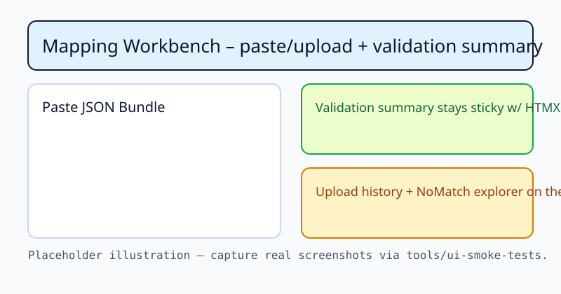
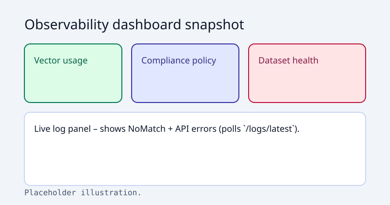
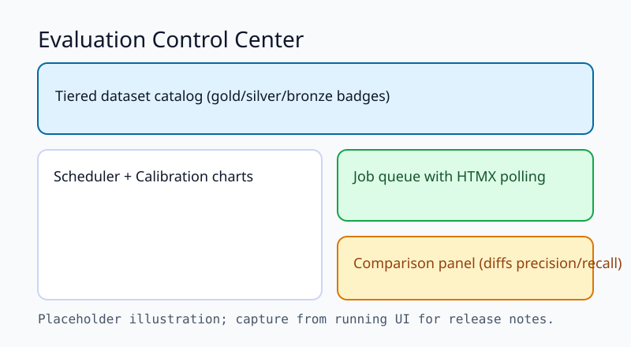

# Frontend Command Center

FE-028 expands the HTMX workbench into a command-center UI that mirrors the CLI/API. Reference screenshots (generated from Playwright captures) help reviewers and release notes stay in sync.

## Mapping workbench

Key callouts:

- Paste/upload forms share validation summaries and sample bundle templates so new users can replay golden data quickly.
- The NoMatch explorer (right rail) keeps remediation hints next to unresolved codes.
- Upload history cards rehydrate past runs without resubmitting bundles.

## Observability dashboard

This route aggregates vector/compliance/dataset health along with a live log stream fed by `/logs/latest`. Use it when troubleshooting eval or mapping spikes—the compliance badge mirrors the `license_blocked` counters emitted by the API.

## Evaluation control center

The eval page now ships:

1. Tier-aware dataset catalog (bronze/silver/gold metadata comes from manifest JSONs).
2. Scheduler + job queue (HTMX polling keeps history fresh; each completed run surfaces precision/recall previews).
3. Calibration cards (score buckets + system stratification) sourced from `EvalSummary.score_buckets`/`by_system`.
4. Comparison panel that diffs two eval runs and highlights deltas in percentage points.

Run through these screenshots whenever FE-028 tasks toggle checkboxes—the runbook explains how to capture fresh assets.

## Dataset & storage admin

The new `/admin/datasets` view exposes the local `refractive_swan_eval::DatasetStore` so you can upload manifests, download fixtures, toggle datasets, trigger regression smoke tests, and reset SQLite datamart files without dropping into the CLI. Use the maintenance console there to clear HTMX caches whenever you tweak local data roots.

## Mesh readiness

We now reserve a `/mesh` page that visualizes node capabilities (via `MeshNodeId`/`NodeCapabilities`), shows stubbed job rows (EvalDataset, AnalyticsQuery), and documents how governance decisions will surface once the mesh runtime ships. In single-node mode it displays only the local workbench node and reminds operators that job submission will wire to `dfps_mesh_node` as endpoints become available.
