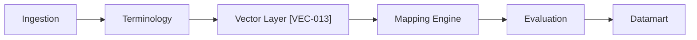

# Roadmap — Current Process to MVP
**Goal:** Trace the critical path to MVP with FOSS-only milestones across ingestion → terminology → vector layer → mapping → evaluation → datamart. Aligns with VEC-013 (vector backend), VEC-06 (docs/runbooks), ALG-014 (algorithms crate).

## Timeline (illustrative)
| Quarter/Sprint | Milestones | Dependencies | Status |
| --- | --- | --- | --- |
| Q1 / S1 | Ingestion solidified (FHIR validation, staging) | Base schemas, validation rules | ✅ |
| Q1 / S2 | Terminology normalization (codesystems, OBO links) | Ingestion outputs | ✅ |
| Q2 / S1 | Vector layer MVP (VEC-013) + vector docs (VEC-06) | Terminology + mapping inputs | ⏳ |
| Q2 / S2 | Mapping engine with vector backend; ALG-014 scaffolding | Vector layer + algorithms crate | ⏳ |
| Q3 / S1 | Evaluation harness (capacity/recall/regression) | Mapping outputs | ⏳ |
| Q3 / S2 | Datamart integration + dashboards | Evaluation + mapping | ⏳ |

## Milestone Checklists
- Ingestion: strict/lenient validation, regression fixtures, observability.
- Terminology: codesystem registry, OBO/NCIt linkage, license tiering.
- Vector layer (VEC-013): VectorStore backend, fallbacks, metrics; VEC-06 docs/runbook.
- Mapping: MappingEngine wired to vector backend; deterministic fallback; thresholds tuned.
- Algorithms (ALG-014): PCA/MDS, geometry metrics, capacity estimators; FOSS-only deps.
- Evaluation: E2E tests, capacity checks, CI gating on metrics deltas.
- Datamart: star schema populated from mapping results; health checks and snapshots.

## Dependencies
- Ingestion → Terminology → Vector layer → Mapping → Evaluation → Datamart.
- Documentation: VEC-06 (vector docs/runbook) depends on VEC-013 behaviors; ALG-014 feeds geometry/capacity docs.

## Swimlane (mermaid)

## Acceptance Criteria
- Roadmap references VEC-013, VEC-06, ALG-014 and keeps milestones FOSS-only.
- Dependencies and critical path documented; milestones have checklists.
- Visual swimlane or equivalent included for reviewer scan.
