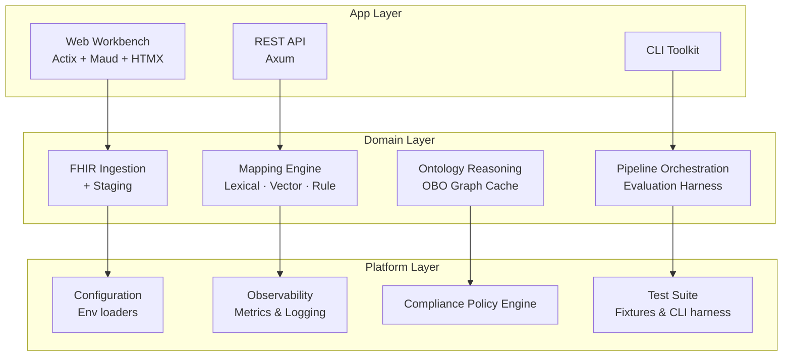

<!-- GitHub Profile README for the Refractive Swan organization -->

<div align="center">
  

  <h1>🦢 Refractive Swan Labs</h1>
  <p><strong>Clinical Terminology Intelligence • Rust-first • Layered • Testable • Open</strong></p>

  <a href="https://github.com/RefractiveSwan/monobase">
    
  </a>
  <a href="https://www.rust-lang.org/">
    
  </a>
  <a href="https://github.com/RefractiveSwan/monobase/blob/main/LICENSE">
    
  </a>
  <a href="https://github.com/RefractiveSwan/monobase/tree/main/docs/system-design">
    
  </a>
  <a href="https://github.com/orgs/RefractiveSwan/projects">
    
  </a>
  <a href="https://github.com/search?q=org%3ARefractiveSwan+language%3Arust&type=repositories">
    
  </a>
</div>

---

## ✨ Focus Areas

| 🔬 Theme | Scholarly Notes |
|----------|-----------------|
| **Terminology Intelligence** | Fuses lexical heuristics, deterministic embeddings, and policy-aware rerankers to map FHIR ServiceRequests into NCIt. |
| **FHIR Ingestion** | Implements staged ETL with optional external validators + profile hooks ([design doc](https://github.com/RefractiveSwan/monobase/tree/main/docs/system-design/clinical/fhir)). |
| **Ontology Reasoning** | Embeds OBO graph reasoning with bounded caches, synonym harmonization, and relation-limited traversals. |
| **Observability** | Records per-run vector capacity, compliance tallies, and evaluation-derived metrics for reproducibility. |
| **Evaluation & QA** | Ships canonical datasets + CLI workflows; each change is gated by unit, integration, regression, snapshot, and e2e suites. |

> “Refractive Swan” nods to light bending through clinical data—precision refraction with calm, observable grace.

---

## 🧠 Research Principles

1. **Deterministic Pipelines** – reproducible ingest→map flows using typed staging structures.  
2. **Transparent Vector Usage** – every vector search reports capacity proxies + fallback counts.  
3. **Ontology Traceability** – NCIt/MONDO cross-references align code, docs, and tests.  
4. **Environment-Free Domains** – domain crates never read env; configuration stays in apps/platform.  
5. **Bidirectional Documentation** – commits cite system-design docs, and docs reference concrete modules.

---

## 🏗 Architecture at a Glance



📚 **Design docs:**  
- Directory architecture → [link](https://github.com/RefractiveSwan/monobase/blob/main/docs/system-design/base/directory-architecture.md)  
- FHIR system → [link](https://github.com/RefractiveSwan/monobase/tree/main/docs/system-design/clinical/fhir)  
- NCIt system → [link](https://github.com/RefractiveSwan/monobase/tree/main/docs/system-design/clinical/ncit)  
- Feature Kanban → [link](https://github.com/RefractiveSwan/monobase/tree/main/docs/kanban/feature)

---

## 🚀 Quick Start (`monobase`)

```bash
git clone https://github.com/RefractiveSwan/monobase.git
cd monobase/code

rustup default stable
cargo install cargo-make mdbook

cp data/environment/.env.app.web.api.example data/environment/.env.app.web.api.dev
cp data/environment/.env.app.web.frontend.example data/environment/.env.app.web.frontend.dev

cargo build
cargo test --all
cargo make mvp-up
```

| Service | URL |
|---------|-----|
| Web Workbench | http://127.0.0.1:8090 |
| REST API | http://127.0.0.1:8080 |
| Docs (mdBook) | http://127.0.0.1:3000 |

---

## 🧪 Testing & Tooling

| Layer | Command |
|-------|---------|
| All crates | `cargo test --all` |
| CLI contracts | `cargo test -p dfps_test_suite --test integration_tests` |
| E2E flows | `cargo test -p dfps_test_suite --test e2e_tests` |
| UI snapshots | `cargo insta test --review` |
| Architecture lint | `cargo make layers-check` |
| Docs build | `cargo make docs && cargo make docs-serve` |
| Vector smoke tests | `cargo test -p dfps_vector_store --features backend-pgvector` |

---

## 📦 Ecosystem Highlights

- **`monobase` (flagship)** – consolidated workspace containing all app/domain/platform crates, docs, and datasets.
- **FHIR Profiles** – embedded structure definitions + profile validation hooks inside the ingestion stack.
- **NCIt / MONDO Data** – curated OBO slices under `data/clinical/ontologies`, versioned with the mapping engine.
- **Evaluation Datasets** – canonical NDJSON gold sets (bronze/silver/gold) with manifest checksums for reproducibility.
- **Observability Harness** – shared metrics objects (`PipelineMetrics`) + vector usage snapshots exported to API/CLI logs.
- **Compliance Engine** – policy loader & enforcement library that keeps mappings aligned with license tiers.

---

## 📡 Interfaces

| Surface | Path (`monobase`) | Highlights |
|---------|-------------------|------------|
| 🖥 Web Workbench | `lib/app/frontend/web` | Actix + Maud + HTMX, analytics dashboards & NoMatch explorer |
| 🌐 REST API | `lib/app/servers/api` | Axum service exposing mapping, metrics, evaluation endpoints |
| 🧰 CLI Toolkit | `lib/app/frontend/cli` | `map_bundles`, `map_codes`, `eval_mapping`, `load_datamart` |
| 📊 Datamart Loader | `lib/app/servers/datamart` | SQLite/star-schema analytics with compliance gating |
| 🔡 Vector Store Ports | `lib/app/servers/vector_store` | Qdrant, pgvector, mock adapters via `dfps_vector_port` |

---

## 🛰 Spotlight Repositories

1. [`monobase`](https://github.com/RefractiveSwan/monobase) – primary workspace containing all Rust crates, docs, and datasets.
2. [`monobase-lab-notebooks`](https://github.com/RefractiveSwan/monobase-lab-notebooks) *(if public)* – experiments, prototype notebooks, and design spikes.
3. [`monobase-devops`](https://github.com/RefractiveSwan/monobase-devops) *(future)* – IaC and deployment scaffolding for cloud environments.

*Not seeing a repo you expect? Check our [Projects board](https://github.com/orgs/RefractiveSwan/projects) or open an issue.*

---

## 🤝 Contributing

1. Pick or add a card in the [Kanban board](https://github.com/RefractiveSwan/monobase/tree/main/docs/kanban/feature).  
2. Read the relevant system-design doc before modifying a module.  
3. Implement, test (`cargo test --all`), update docs + Kanban.  
4. Submit PR with `type(CARD-ID): summary` commits (see [CONTRIBUTING](https://github.com/RefractiveSwan/monobase/blob/main/CONTRIBUTING.md)).  

---

## 📬 Stay in Touch

- Issues & PRs → [GitHub tracker](https://github.com/RefractiveSwan/monobase/issues)  
- Architecture & runbooks → [`docs/system-design`](https://github.com/RefractiveSwan/monobase/tree/main/docs/system-design), [`docs/runbook`](https://github.com/RefractiveSwan/monobase/tree/main/docs/runbook)  
- Release notes → [`CHANGELOG.md`](https://github.com/RefractiveSwan/monobase/blob/main/CHANGELOG.md)

```
          .-.
         (o o)
     ___ooO Ooo___
```
