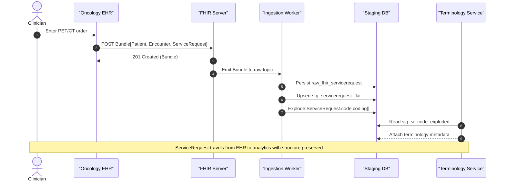

# FHIR ServiceRequest end-to-end sequence

**Related diagrams**

- [System architecture](../architecture/system-architecture.md)
- [ServiceRequest state lifecycle](./state-servicerequest.md)
- [Ingestion ER model](../models/data-model-er.md)
- [Pipeline mindmap](../concepts/mindmap-pipeline.md)

## Validation + typed staging rows

- `dfps_ingestion::ValidatedBundle::try_new(bundle, mode, context)` validates a Bundle once (Strict/Lenient/External) and carries the `ValidationReport` alongside the owned payload. Pipeline and CLI surfaces call `bundle_to_mapped_sr_from_validated_bundle()` to avoid re-running validation when the caller already inspected the report.
- `bundle_to_staging_from_validated()` / `bundle_to_domain_from_validated()` reuse the cached report but still produce fresh staging/domain structs for downstream processing.
- `StgServiceRequestFlat` now carries `status_enum: ServiceRequestStatus` and `intent_enum: ServiceRequestIntent` fields derived during ingestion so datamart/mapping layers no longer need to re-normalize the string fields. Legacy JSON payloads deserialize with sane defaults and can opt-in to the enums when re-emitted via contracts.
- `dfps_pipeline::PipelineExecution` surfaces a per-run `PipelineMetrics` snapshot that downstream apps can merge/log via `dfps_observability::log_pipeline_output_with_summary`, avoiding ad-hoc recounting of AutoMapped/NeedsReview/NoMatch totals.
