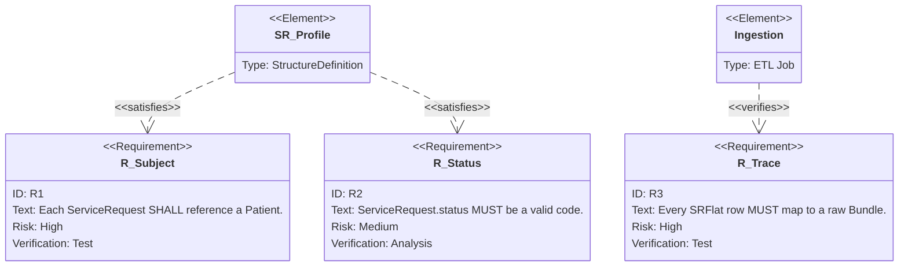

## Verification linkage

The `dfps_ingestion::validation` module enforces these requirements via the
`validate_sr` helper:

- `RequirementRef::RSubject` -> `VAL_SR_SUBJECT_*` issues ensure every ServiceRequest carries a `Patient/<id>` subject reference.
- `RequirementRef::RSubject` -> `VAL_SR_SUBJECT_PATIENT_NOT_FOUND` additionally ensures the referenced Patient resource exists in the same Bundle.
- `RequirementRef::RStatus` -> `VAL_SR_STATUS_*` issues ensure statuses normalize to the supported vocabulary (`active`, `draft`, etc.).
- `RequirementRef::RTrace` -> `VAL_SR_TRACE_*` issues ensure stable identifiers (e.g., `ServiceRequest.id`) are present so staging rows can be traced back to source Bundles, and `VAL_SR_ENCOUNTER_NOT_FOUND` warns when optional encounter references cannot be resolved.

Downstream callers can inspect each `ValidationIssue`'s `requirement_ref()` to
tie failures directly to the diagram IDs above.

## Profile mapping

DFPS embeds lightweight `StructureDefinition` snapshots via `dfps_fhir_profiles` and ties
ingestion requirements to explicit profile paths:

- `R_Subject` → `ServiceRequest.subject`
- `R_Status` → `ServiceRequest.status`
- `R_Trace` → `ServiceRequest.id`

When the `profile_validation` feature is enabled, `validate_bundle_with_external_profile`
applies these cardinalities on top of hand-written validation to surface
profile-aware `ValidationIssue`s alongside existing checks.
