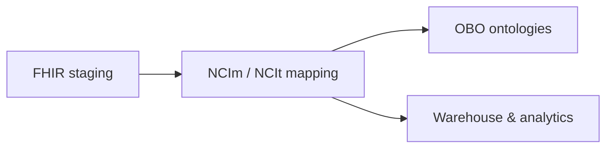
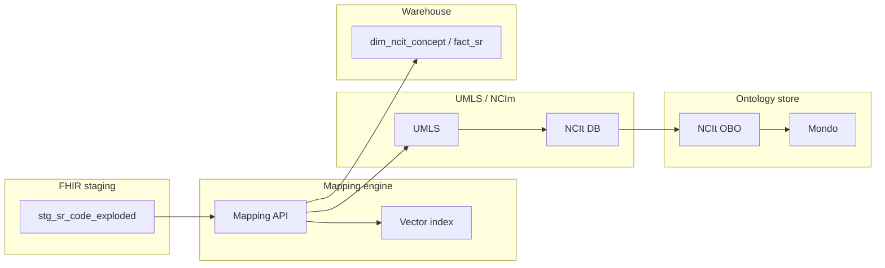

# NCIm / NCIt Mapping & Analytics Architecture

## Legend

- [Square nodes] – entities/tables
- (Rounded nodes) – services/processes
- Subgraphs – layers (Staging, Mapping, UMLS/NCIm, OBO, Warehouse)

## High-level mapping pipeline

## Architecture (mapping platform)

## Implementation references

- Rust modules: `refractive_swan_core::mapping`, `refractive_swan_mapping::MappingEngine`,
  `refractive_swan_pipeline::bundle_to_mapped_sr`.
- Embedded mock vocabularies live under `lib/mapping/data/*` and are versioned
  for reproducibility.
- The `map_bundles` CLI in `refractive_swan_pipeline` streams NDJSON Bundles through the
  staging + mapping layers for demos and smoke tests.

## Mapping states & thresholds

The mapping engine emits a `MappingResult` per `CodeElement`, annotated with
`MappingState`:

| State        | Condition                                  | Action                                         |
|--------------|--------------------------------------------|------------------------------------------------|
| AutoMapped   | Score ≥ 0.95 (default)                     | Persist & link to NCIt without manual review   |
| NeedsReview  | 0.60 ≤ score < 0.95                        | Surface to curation queue                      |
| NoMatch      | Score < 0.60 or missing identifiers        | Track with `reason` + provenance for triage    |

These thresholds are configurable in `refractive_swan_mapping` (see MAP-07) and referenced
by the NCIt behavior diagrams. When `state == NoMatch`, the `reason` field
describes whether we fell below thresholds or lacked identifiers. The
explainability helpers (MAP-11) and the `map_codes --explain` CLI flag expose
the ranked candidates so reviewers can understand why a state was chosen.
