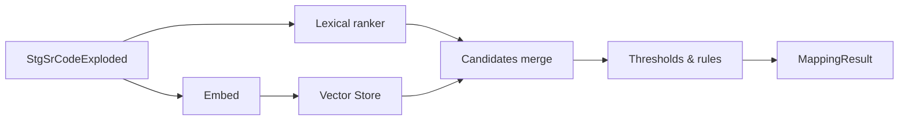

# Vector Layer for NCIt Mapping

Short abstract: Vector-assisted candidate retrieval layer that sits between FHIR staging codes and `MappingEngine`, enriching lexical ranking with ANN lookups against NCIt/UMLS reference embeddings while preserving deterministic fallbacks and GPLv3/FOSS-only posture.

## Responsibilities
- Index reference ontologies and UMLS cross-references into a vector store (NCIt concepts, UMLS xrefs, dimensionality pinned e.g., 768).
- Search top-k candidates per staging code using ANN indexes; merge with lexical ranker before thresholding.
- Enforce health probes and deterministic fallback to lexical + mock ranker when disabled/unhealthy.

## Backends
| Backend | FOSS | Ops notes | ANN indexes | Pros | Cons |
| --- | --- | --- | --- | --- | --- |
| pgvector | Yes (Postgres + extension) | Reuse Postgres ops; tune `maintenance_work_mem`, IVFFLAT lists | IVFFLAT, HNSW (newer releases) | Simple deployment; SQL tooling | ANN choices narrower; VACUUM/ANALYZE needed |
| Qdrant | Yes | HTTP/gRPC service; collection bootstrap; snapshots for backup | HNSW | Strong ANN + filters; easy multi-tenant | Extra service to run; tune RAM for graphs |
| Milvus | Yes | Heavier stack (etcd/MinIO optional); gRPC/HTTP | IVF, HNSW, disk-based | Scales large corpora; varied index types | More ops surface; higher resource floor |

## Namespaces & Schema
- Namespace all rows; composite PK `(namespace, ref_id)` to avoid collisions across environments or code systems.
- Store embedding dimension explicitly (e.g., `VECTOR(768)` for pgvector) and version (`embedding_version`) for drift tracking.
- Index payload: `{ ref_id, codesystem, display, embedding, metadata { source_version, license_tier, embedding_version } }`.

## Embedding Sources
- Deterministic TF-IDF/SVD (FOSS) for baseline offline mode.
- Sentence encoders (FOSS/OSS) permitted under GPLv3-compatible licenses (e.g., open models from Hugging Face); pin model name/version.
- Generated via CLI builder (`dfps_cli build-vector-index`) that loads NCIt concepts + UMLS xrefs and bulk-writes to the configured namespace.

## Fallback Behavior
- `DFPS_VECTOR_ENABLED=false` → skip vector store; use lexical + mock vector ranker; log “vector disabled”.
- Health probe failure or search timeout → warn once per batch, increment `vector_fallbacks`, retry once then fall back deterministically.
- Missing index/namespace → log warning, continue with lexical + mock to keep pipelines deterministic.

## Observability
- Metrics: `vector_queries`, `vector_hits`, `vector_fallbacks`, search latency (mean/p95), tagged with `backend` and `namespace`.
- Capacity proxies (when surfaced by the backend or mock): `geom_rm`, `geom_dm`, `geom_rm_sqrt_dm`, `cap_alpha_sim`; logged alongside vector counters for drift detection.
- Logs: health probe failures, index build start/finish, per-namespace counts; structured fields for backend, namespace, duration_ms, error.
- Surface metrics via `dfps_observability` and expose counts alongside pipeline metrics consumers.

Complexity notes:
- Deterministic embedding is `O(d)` for dimensionality `d`; search is `O(kd)` for top-k without ANN, with `O(n log n)` upfront collection/index creation on first bootstrap. If the backend is down or times out, the pipeline logs the failure, increments `vector_fallbacks`, and reverts to lexical + mock ranking deterministically.

## Capacity checklist
- Embedding metadata: `embedding_version` pinned; `dim` recorded per collection/namespace.
- Geometry stats: track `geom_rm`, `geom_dm`, `geom_rm_sqrt_dm`, `geom_centroid_cos` (if available) and `cap_alpha_sim` per build; compare against prior baselines for drift.
- Norms/participation ratio: record mean/median vector norm and participation ratio from index build logs to spot collapse or explosion.
- Community health (Leiden/Louvain): snapshot cluster/graph health where available; flag unexpected community splits/merges across builds.
- Fallback posture: toggling `DFPS_VECTOR_ENABLED=false` or health failures must preserve deterministic lexical+mock behavior, with `vector_fallbacks` incremented and structured warning logs.
- Latency budgets: track search p95; gate CI if vector-enabled latency exceeds baseline by budget or if recall drops > X% vs mock/lexical baseline.

## Cross-Links
- FHIR overview: `../../fhir/overview.md`
- NCIt architecture: `../../ncit/architecture/system-architecture.md`
