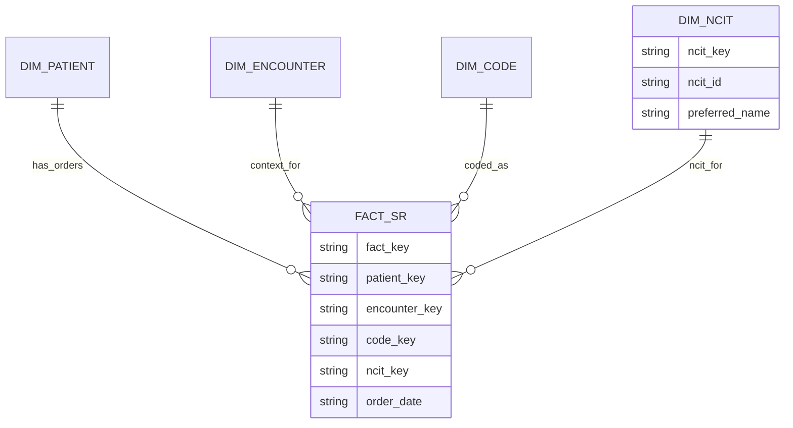

# ERD: NCIt-enhanced analytics mart

## Implementation notes

- The mart is materialized by `lib/platform/data/data-plane/mart` (`refractive_swan_datamart`). Its
  `from_pipeline_output` helper ingests `refractive_swan_pipeline::PipelineOutput` and
  produces `(Dims, Vec<FactServiceRequest>)`.
- Each dimension uses deterministic surrogate keys derived from natural
  identifiers (`patient_id`, `encounter_id`, `code_element_id`, `ncit_id`) so the
  same Bundle always yields stable FK relationships.
- `FactServiceRequest` snapshots status/intent/description plus the order
  timestamp (`ordered_at`) and always references valid dim keys. When the mapping
  engine reports `MappingState::NoMatch`, the mart links the fact to a shared
  sentinel `DimNCIT` row (`ncit_id = "NO_MATCH"`) instead of leaving `ncit_key`
  empty, keeping downstream joins simple.
- The SQL layout in `refractive_swan_datamart::sql` mirrors these dims/facts:
  - `dim_patient(patient_key, patient_id)`
  - `dim_encounter(encounter_key, encounter_id, patient_key)`
  - `dim_code(code_key, code_element_id, system, code, display)`
  - `dim_ncit(ncit_key, ncit_id, preferred_name, semantic_group)` (includes `NO_MATCH`)
  - `fact_service_request(sr_id, patient_key, encounter_key, code_key, ncit_key, status, intent, description, ordered_at)`
  Migration DDL lives under `data/sql/migrations/0001_init.sql`; loader APIs (`load_from_pipeline_output`) upsert dims and insert facts with FK validation.
